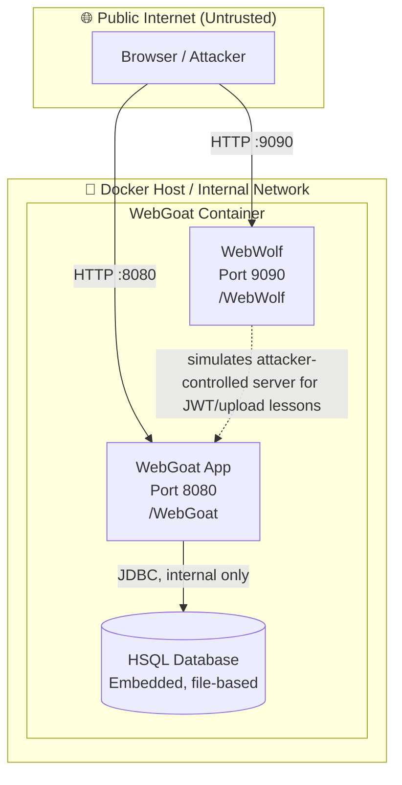

# WebGoat Architecture

## Trust Boundaries

| Boundary | Contains | Notes |
|---|---|---|
| Public Internet | Browser | Fully untrusted — attacker-controlled |
| Docker Host / Internal Network | WebGoat container | Exposed ports 8080, 9090 to host |
| Inside Container | WebGoat JVM, WebWolf, HSQL DB | No network boundary between app and DB — DB is embedded, not a separate service |

## Data Flows

1. **Browser → WebGoat (8080)** — login, lesson content, exploit submissions
2. **Browser → WebWolf (9090)** — used by specific lessons (JWT, password reset, file upload) to simulate an external attacker-controlled endpoint
3. **WebGoat → HSQL DB** — internal JDBC connection, no network exposure, file-based storage inside the container